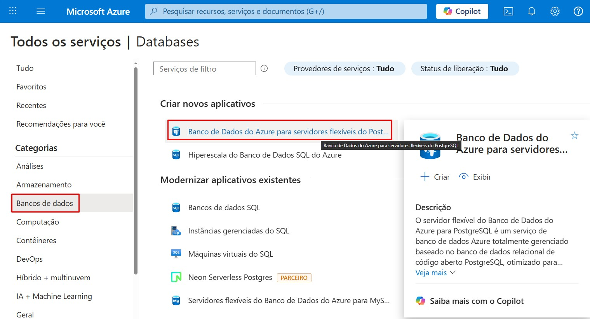
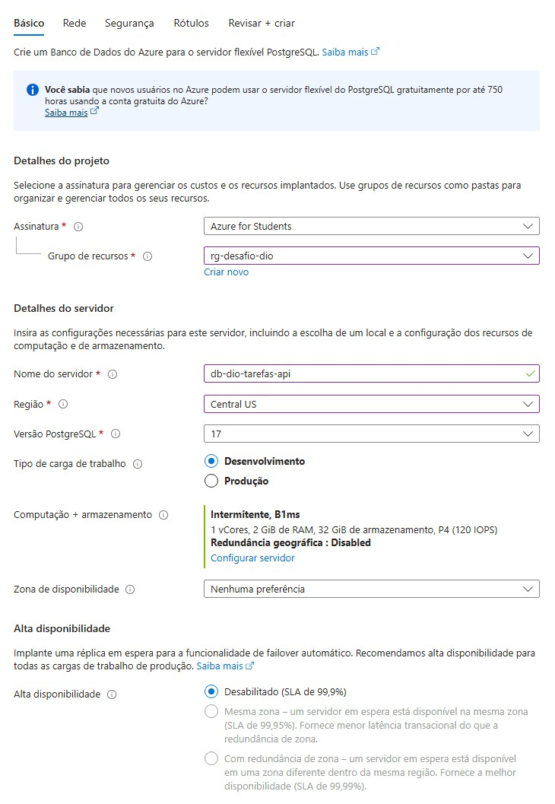
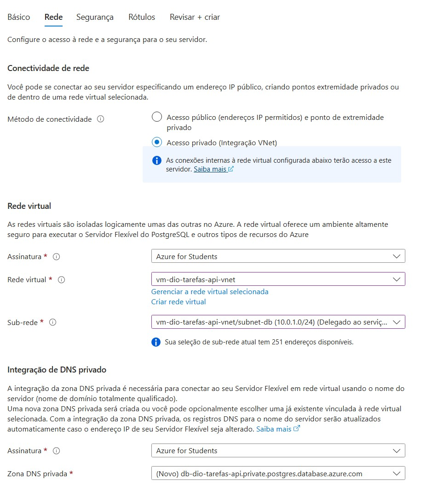
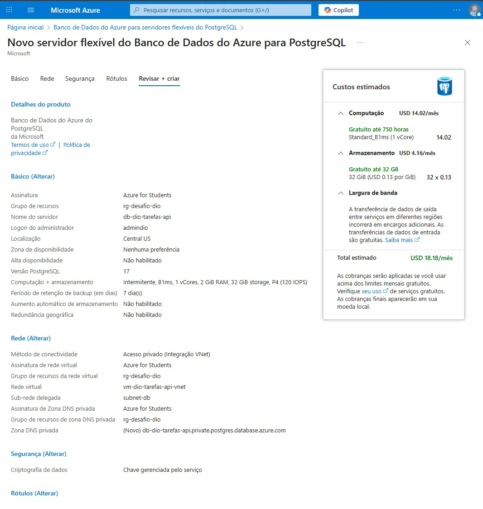
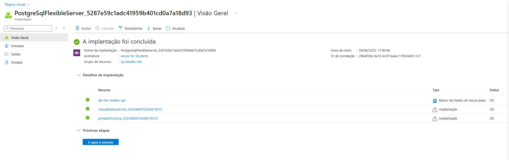

# 🗄️ Desafio de Projeto: Provisionando Banco de Dados na Azure

Este repositório documenta a criação de um serviço de banco de dados gerenciado **(PaaS)** na nuvem **Microsoft Azure**, utilizando o **Banco de Dados do Azure para PostgreSQL (Servidor Flexível)**.

O objetivo deste desafio do **Bootcamp .NET da DIO** foi aplicar de forma prática os conhecimentos sobre serviços de persistência de dados na nuvem. A criação deste banco de dados foi uma etapa crucial para suportar uma aplicação real.

## 🚀 **O projeto final, com a API online, arquitetura detalhada e todo o código-fonte, está no repositório principal:**
- ### [➡️ Clique aqui para ver a Solução Completa](https://github.com/GustavoHerreira/todoapp-trilha-dotnet-api-desafio)

---

## 🛠️ Arquitetura do Serviço de Dados

O banco de dados foi provisionado com foco em três pilares: **Segurança, Custo-Benefício e Integração de Rede**.

| Pilar | Decisão Técnica | Justificativa |
| :--- | :--- | :--- |
| 🛡️ **Segurança** | **Acesso Privado (Integração VNet)** & **Delegação de Sub-rede** | O banco de dados não possui IP público e é inacessível pela internet. A sua sub-rede foi delegada ao serviço do PostgreSQL, garantindo a máxima segurança e isolamento. |
| 💰 **Custo-Benefício** | **Região `Central US`** & **Computação `B1ms` (Expansível)** | Escolha de uma região com menor custo e uma instância da série B, aproveitando a oferta de 750 horas gratuitas para máxima eficiência de custos. |
| 🔗 **Conectividade** | **Zona DNS Privada** & ***Integração VNet*** | A comunicação entre a API e o banco de dados ocorre de forma privada e otimizada na mesma Rede Virtual (VNet), utilizando um DNS privado para a resolução de nomes. |

---

## ✅ Prova de Execução: Screenshots do Processo

A seguir, a documentação visual do provisionamento do Banco de Dados no Portal Azure.

#### 1. Seleção do Serviço (Servidor Flexível)
*Escolha da opção PaaS moderna e recomendada para PostgreSQL na Azure.*

#### 2. Configurações Básicas
*Definição do grupo de recursos, região, e otimização para carga de trabalho de "Desenvolvimento".*

#### 3. Configuração de Rede Privada
*Seleção da integração com a VNet da aplicação e criação de uma sub-rede dedicada e delegada para o banco de dados.*

#### 4. Validação e Confirmação
*Tela final de revisão, resumindo todas as configurações de arquitetura e custos antes da criação.*

#### 5. Implantação Concluída
*Confirmação do Portal Azure de que o banco de dados e todos os seus componentes de rede foram provisionados com sucesso.*

---

## 👉 Próximo Passo: O Projeto Real

A criação deste banco de dados foi a camada de persistência. Para ver como este serviço PaaS foi de fato utilizado para:
* Armazenar os dados de uma **API .NET containerizada**.
* Conectar-se de forma segura a partir de uma **VM (IaaS)** dentro da mesma rede privada.
* Suportar uma **aplicação completa e funcional**.

**Visite o repositório principal do projeto!**

### [➡️ Ver o Projeto Completo e a API em Produção](https://github.com/GustavoHerreira/todoapp-trilha-dotnet-api-desafio)
